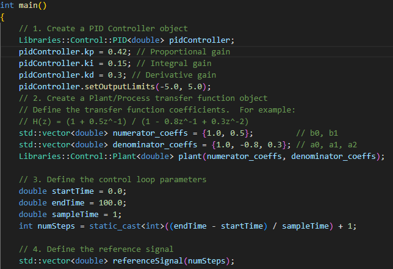
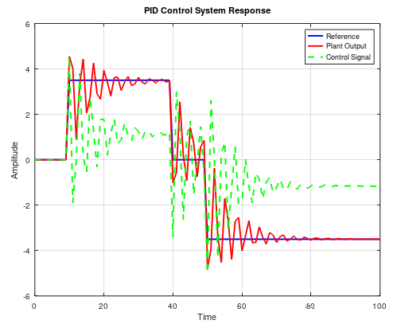

This project contains an implementation of a PID controller

The controller is implemented in C++ and its corresponding testing and visualization is developed in Octave

## Configuration
Select the desired properties of the Plant and the Controller in the file `createPID.cpp`


## Excecution

### For Linux users
The project contains a Bash skript for excecution in Linux. Execute the file `run_plotter.sh` developed in Linux Manjaro.

```bash
chmod +x run_plotter.sh # Give execution permissions
./run_plotter.sh # Runs Script
```

### For Windows users (PowerShell)
Execute script `run_plotter.ps1` on PowerShell 

## Plot


